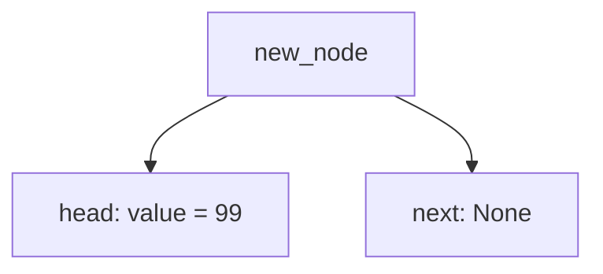
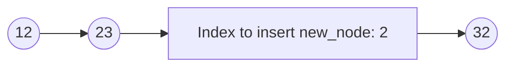
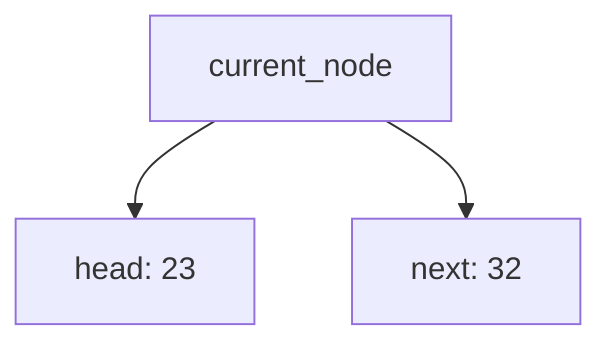
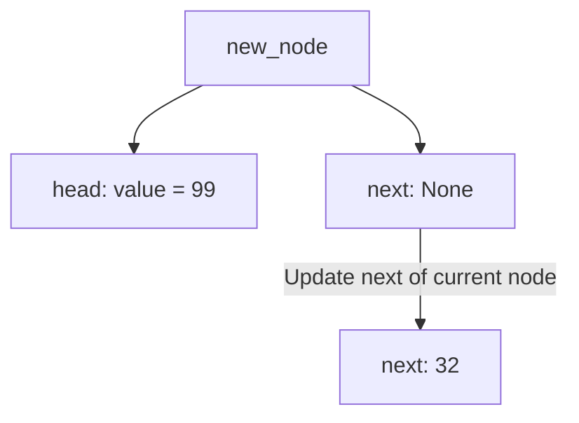
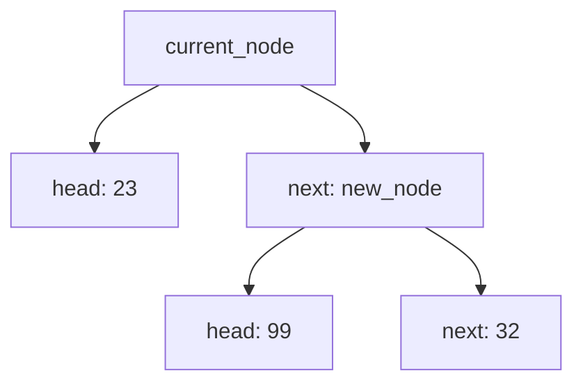
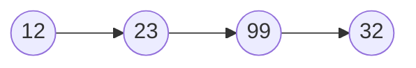
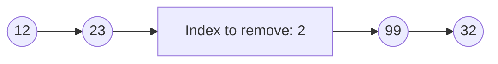
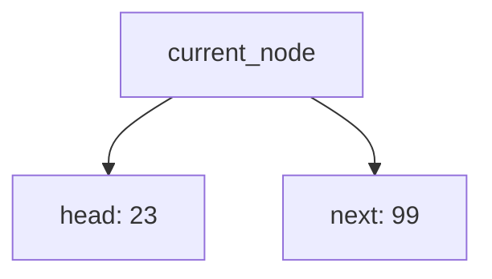
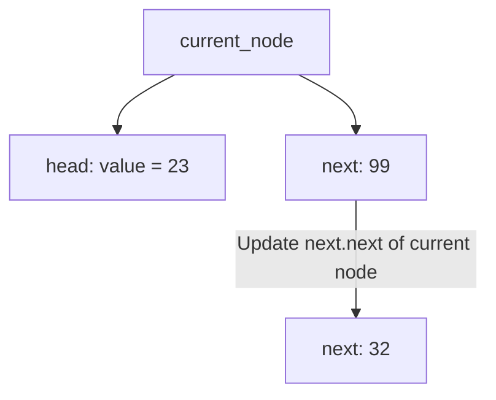
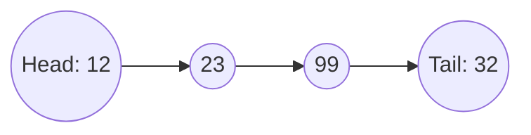

**Linked List**

|Action| Time complexity  |
|--|--|
| prepend |O(1)  |
| append |O(1)  |
| lookup |O(1)  |
| insert |O(1)  |
|  delete|O(1)  |

**Pointers**

Reference to the same place in memory

e.g.
```python
obj1 = {"a":True}
obj2 = obj1
```
obj2 is pointing to obj1 so if we change obj1 we also change obj2, the fact is that obj2 is just a reference of memory of obj1. 

**Linked List implementation Python**

Logic

10 -->5 -->16
So the head is 10 and the tail is 16

The structure that we need is:
```python
mylinkedlist = {
	'head': {'value': 10,
	 'next':{'value':5,
	 'next':{'value':16,
	 'next': None}}}}	
```

Linked list to make it work

```python
class Node():
	def __init__(self, value):
		self.head = value
		self.next = None
class LinkedList():
    def __init__(self, value):
        self.head = Node(value) # since list is empty point to None
        self.tail = self.head # point to the head
        self.length = 1 # no length

    def append(self, value):
        new_node = Node(value)
        self.tail.next = new_node
        self.tail = new_node
        self.length += 1
        
    def prepend(self, value):
	    new_node = Node(value)
	    new_node.next = self.head
	    self.head = new_node
	    self.length += 1

    def printlist(self):
        array = []
        current_node = self.head
        while (current_node != None):
            array.append(current_node.head)
            current_node = current_node.next
        return array
    
    def insert(self,index, value):
        if index >= self.length:
            if index > self.length:
                print("Position not available")
            new_node = Node(value)
            self.tail.next = new_node
            self.tail = new_node
            self.length += 1
        elif index == 0:
            new_node = Node(value)
            new_node.next = self.head
            self.head = new_node
            self.length += 1
        else:
            new_node = Node(value)
            current_node = self.head
            for i in range(index-1):
                current_node = current_node.next
            new_node.next = current_node.next
            current_node.next = new_node
            self.length += 1
        
    def remove(self, index):
        current_node = self.head
        for i in range(index-1):
            current_node = current_node.next
        current_node.next = current_node.next.next
        self.length += 1
        
        return
    
```

First we define a class node which will act as a blueprint for each of our nodes

Let's create the node

```python
class Node():
	def __init__(self, data):
		self.data = data
		self.next = None
```

so we need to have ``self.head`` which is the **head pointer to the beginning of the list** and  ``self.tail`` which is a **tail pointer to the end of the list** a ``self.length`` to keep track of the length of the linked list

```python
class LinkedList():
	def __init__(self):
		self.head = None # since list is empty point to None
		self.tail = self.head # point to the head
		self.length = 0 # no length
```
**Append**

Now let's create the append method, which will add a node to the end of the linked list. So for every element of a linked list we want to store the head, tail and length.

Every new element will have a head and next, the head will point to our data and the next will point to None, makes sense since we append to the end of the list. That's our first thing to do: ``new_node = Node(data)`` That node will create an object with two instance: **head** which will point to our new added data, and **next** that point to none. 

``new_node.head`` will display the recent added value
``new_node.next`` will return none

Since we want to store at the end of the list, we need to check if the list is empty or not by checking the head. 

If the head is empty, the head of our list will be the recent-added node (**head** and **next**), the tail will point to the head, and the **length** will be 1.

If the list is not empty, the **head** will remain the same, the ``tail.next`` which came from our node will store the new node (**head** and **next**), we also need to update our tail to point to our node. Finally, we increase the length.

```python
def append(self, data):
	new_node = Node(data)
	if self.head = None:
		self.head.data = new_node
		self.tail = self.head
		self.length = 1
	else:
		self.tail.next = new_node
		self.tail = new_node
		self.length += 1
```
**Prepend**

Prepend method allow adding a node at the head of the list.


As any other method of the linked list, we need to create the node. In the **prepend** the head becomes the new value, and the next of the head is the previous head.

If the list is empty, the head will point to the new node and the tail to the head. 

If the list is not empty, the value ``next`` to the ``head`` will point to the previous ``head`` and the ``head`` will point to the new value.

```python
def prepend(self, value):
	new_node = Node(value)
	if self.head == None:
		self.head = new_node
		self.tail = self.head
		self.length += 1
	else:
		new_node.next = self.head
		self.head = new_node
		self.length += 1		

```

**Print List**

Instead of a dictionary, it will print an array with the values of our list. The iteration of every item and the array to store the list has a complexity of O(n) in memory and in time. 

```python
def print_list(self):
	if self.head == None:
		print("Empty")
	else:
		array = []
		current_node = self.head
		while current_node != None:
			array.append(current_node.head)
			current_node = current_node.next
```

**Insert**


The insert method of linked list involves iteration over every element, which we can already tell that this operation will be O(n) in terms of time complexity. 

The head will still point to the previous head, the tail will remain unchanged, but what we need to do is to iterate over every element until we found the index that match. 

There are three possible situations:

1. The position is greater than the list → append method
2. The position is 0 --> prepend method
3. The position is in between

```python
def insert(self, index, value):
	if index >= self.length:
		if index > self.length:
			print("Position not available, insert at the end of the list")
		new_node = Node(value)
		self.tail.next = new_node
		self.tail = new_node
		self.length += 1
	elif index == 0:
		new_node = Node(value)
		new_node.next = self.head
		self.head = new_node
		self.length += 1
	else:
		new_node = Node(value)
		current_node = self.head
		for i in range(index-1):
			current_node = current_node.next
		new_node.next = current_node.next
		current_node.next = new_node
		self.length += 1
```

The way we iterate will be going over each element until we found the one that is pointing to the index that we want to insert, once we found that it would be our ``current_node`` that has two elements ``head`` and ``next``




Once we found the index-1 from which we want to insert the new node we obtain the ``current node``, the **head of the current node is 23** and the **next of the current node is 32**


We updated the new node and assign the next of the current node

Finally, we update the current node to have the new node in their next instance.



**Remove**


To remove an element in a linked list we need to iterate over every element of the linked list until we find the one that is pointing to the element that we need.



Once we found the index-1 from which we want to insert the new node we obtain the ``current node``, the **head of the current node is 23** and the **next of the current node is 99**



```python
def remove_index(self, index):
	if self.head == None:
		print("Linked List is empty")
		return
	if index == 0:
		self.head = self.head.next
		if self.head == None or self.head.next == None:
			self.tail = self.head
		self.length -= 1
		return
	if index >= self.length:
		index = self.length-1
	current_node = self.head
	for i in range(index-1):
		current_node = current_node.next
	current_node.next = current_node.next.next
	self.length += 1
	if current_node.next = None:
		self.tail = current_node
	return
```

**Reverse**
A common question on interview is to reverse a linked list.


We have a head (12) and a tail (32) each one of them with two elements ``Head`` and ``next``

What we need is to iterate the head and move it to the tail of the list.

- We create a variable to store the head, which will contain the 12 and 23. ``first = self.head``
- Store the head on the tail ``self.tail = self.head``
- Store the next element of the ``first`` that store the old head into a ``second`` variable. 
- Iterate over every element of the list until you get a null value
- Store each ``next`` element of the ``second`` variable into ``temp``
- Update ``second.next`` to be the first, which is the head


**Doubly Linked Lists**

Allows to run backwards, using double linked list we are able to know what came before certain values

|Action|Time complexity  |
|--|--|
|prepend  |O(1)  |
|append  |O(1)  |
|lookup |O(n)  |
|insert  |O(n)  |
|delete  |O(n)  |

**Single Linked list vs Double Linked list**

Single has a simple implementation with less memory and is faster. The downside is that it cannot be reversed. I's mainly use for fast insertion and deletion, but is not really use for searching and memory is a constraint. 

A double linked list can be iterated front and back. It's complex to implement, and it requires more memory and storage due to that extra property.

Popular question is to reverse a linked list


# Linked lists

A key feature of the linked lists is a list node

## List node

Have two pointers: ``value`` and the ``next``

```
class Node():
	def __init__(self, value):
		self.value = value
		self.next = None
	
```

The ``next`` pointer is linked to the address of the another node. 

ListNode1: ListNode1.next -> points to ListNode2
ListNode2: ListNode2.next -> points to ListNode3
ListNode3: ListNode3.next -> points to None


It's also important to have two pointer of our linked list, one that points to the head, and the other one to the tail of the linked list. 

## Search

To search in a linked list, we can iterate over every element using a while loop, this property is because the last element is pointing to null. 

```python
# we initialize to node 1
cur = ListNode1
# iterate over every element until cur becomes null
while cur != None:
	# update cur to the next node
	cur = cur.next
```
Time complexity: O(n)

## Adding elements

ListNode4

The last element of our linked lists is ``ListNode3`` that is pointing to ``None`` 

What we should do to add a new element is to change the pointer to null to the new node.

Since we have a pointer to the tail of the list we can use it
```
# None now becomes ListNode4
tail.next = ListNode4
# ListNode3 now becomes ListNode4
tail = ListNode4
```
Time complexity: O(1)

## Removing elements

This operation is always a constant time operation if we have a pointer to the previous element. But if we have to search for the element this would be O(n). 

Linked lists
A key feature of the linked lists is a list node

List node
Have two pointers: value and the next

```python
class Node():
	def __init__(self, value):
		self.value = value
		self.next = None
```
The next pointer is linked to the address of the another node.

ListNode1: ListNode1.next -> points to ListNode2
ListNode2: ListNode2.next -> points to ListNode3
ListNode3: ListNode3.next -> points to None

image

It’s also important to have two pointer of our linked list, one that points to the head, and the other one to the tail of the linked list.

Search
To search in a linked list, we can iterate over every element using a while loop, this property is because the last element is pointing to null.

```python
# we initialize to node 1
cur = ListNode1
# iterate over every element until cur becomes null
while cur != None:
	# update cur to the next node
	cur = cur.next
```
Time complexity: O(n)

Adding elements
ListNode4

The last element of our linked lists is ListNode3 that is pointing to None

What we should do to add a new element is to change the pointer to null to the new node.

Since we have a pointer to the tail of the list we can use it

```python
# None now becomes ListNode4
tail.next = ListNode4
# ListNode3 now becomes ListNode4
tail = ListNode4
```
Time complexity: O(1)

Removing elements
This operation is always a constant time operation if we have a pointer to the previous element. But if we have to search for the element this would be O(n).

Markdown 1628 bytes 269 words 65 lines Ln 60, Col 158HTML 1158 characters 257 words 34 paragraphs